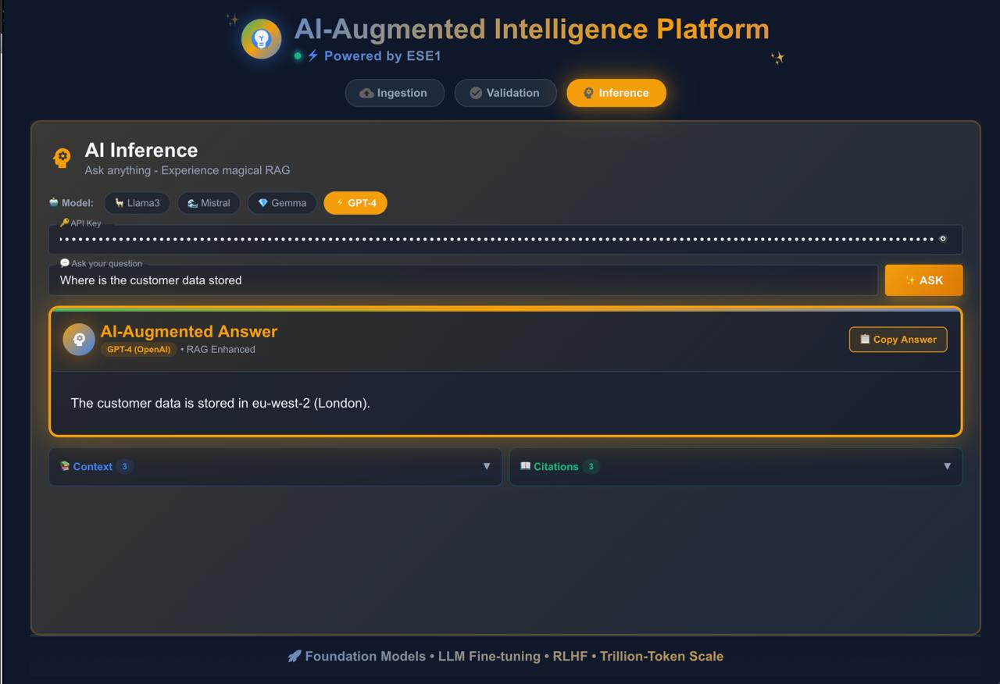

# ESE1 

# Power Platform Documentation Generator

## 1. Objective

Build an application that automatically generates high-quality technical documentation from Microsoft Power Platform solution files, powered by a **Retrieval-Augmented Generation (RAG) pipeline** for backend processing and **NextJS** as the user-facing interface

The solution aims to simplify documentation production for consultants, developers, and business users by analysing solution components and producing structured, import-ready outputs

---

## 2. Core Features & Requirements

### Must Haves

| Requirement | Description |
|-------------|-------------|
| **Power Platform Solution Analysis** | Extract and document key artefacts from Solution Files, initially focusing on: <br>• Power Apps <br>• Power Automate <br>• Dataverse <br>• SharePoint |
| **Tech Documentation Generation** | Automatically create structured technical documentation using a RAG pipeline and generative AI |
| **Entity Relationship Diagram (ERD)** | Generate ERDs based on Dataverse/SharePoint/solution data |
| **Solution Overview / Architecture Diagram** | Auto-generate architecture diagrams from solution metadata and user inputs |
| **Export to Customer – target system** | Output must be compatible with target system import format (defined template) |
| **Tech Stack Alignment** | Backend & processing must use Customer-friendly stack: <br>• C# <br>• NodeJS <br>• JavaScript <br>• .NET |
| **User-Friendly Frontend** | UI/UX must support non-technical users via **NextJS** |

---

### Should Haves

| Requirement |
|-------------|
| Use additional existing project documentation as context for better output |
| Process project requirement docs to enhance generated documentation |
| Expand support for more Power Platform components: <br>• CoPilot Studio <br>• Power BI |
| Support Microsoft OAuth 2.0 for authentication & security |

---

### Could Haves

| Requirement | 
|-------------|
| Direct API integration with target system system for auto-upload |
| Conversational AI Agent UI to guide users through documentation creation |

---

### Won’t Haves (Out of Scope)

| Excluded Feature | Reason |
|------------------|--------|
| Analysis of non-Power Platform Microsoft tools | Not required for MVP |
| Deployment as a Power Apps Canvas App | Application will run standalone (Web UI only) |

---

## 3. High-Level Architecture

```

User (NextJS) ─▶ API Layer (.NET / NodeJS)
│
▼
File Upload / Inputs
│
▼
Solution File Parser (C#)
│
▼
RAG Pipeline (LLM + Vector DB)
│
├─► Technical Documentation Generator
├─► ERD Generator
└─► Architecture Diagram Generator
│
▼
Export + target system-formatted Output

```

---


## 4. Target Users

- Power Platform Developers & Consultants  
- Solution Architects  
- Presales / Documentation Teams  
- Business Analysts  
- Non-technical stakeholders needing fast documentation

---

## 5. Success Criteria

- Generates technical documentation from solution files with minimal user interaction
- Outputs valid ERD and architecture diagrams  
- Output importable into target system  
- Works with selected Customer tech stack  
- UI usable without technical training  

---


# RAG demo

As part of Sprint 2, to address project level uncertainty on what tools we should use, we developed a RAG demo which takes input files, chunks the files, creates embeddings, stores them in a vecttor database and allows users to use a chatbot to query them to get insights on the files 

This was very helpful in our process of choosing an architecture to tackle the project




## Quick start

1. Create a virtual environment and activate it (macOS / zsh):

```bash
python3 -m venv venv
source venv/bin/activate
pip install -r requirements.txt
```

2. Create a `.env` file from the example and fill your keys (optional but convenient):

```bash
cp .env.example .env
# edit .env and paste your keys
```

3. Run the script (it expects PDF files in `./data`):

```bash
python advanced_rag.py
```

## Environment variables

- `OPENAI_API_KEY` (required)
- `LLAMA_CLOUD_API_KEY` (required)

The script optionally reads `.env` if you install `python-dotenv` (not required). The file `.env.example` is included as a template. DO NOT commit real `.env` files.

## Production readiness checklist (short)

- Persistent vector store (FAISS/Chroma/Weaviate) with on-disk persistence and versioning — ETA: 1-2 days
- Better ingestion pipeline: normalization, deduplication, metadata enrichment, error retries — ETA: 1-2 days
- Config-driven parameters (via config file or env) for chunk sizes, retriever top_k, reranker model — ETA: 0.5 day
- CI that runs unit tests and lint on push — ETA: 0.5 day
- Integration tests (optional) that run against real LLM/embedding providers — ETA: 1-2 days (requires API creds for CI)
- Monitoring/telemetry for query latency, errors, and RAG hallucination metrics — ETA: 2-3 days

If you want I can implement the above items incrementally. Tell me which you'd like next and I'll create a plan and PR-style edits.

## Chroma (optional)

- This project includes an optional Chroma-backed index. Install `chromadb` (already in requirements) to enable it. The code falls back to the in-memory VectorStoreIndex if Chroma isn't available.
- Use `build_chroma_index(documents)` to create or use the Chroma-backed retriever.

## CI

- A basic GitHub Actions workflow is included at `.github/workflows/ci.yml` that installs dependencies and runs tests on push/PR. If you want linting (ruff/flake8) or coverage, I can add them.

## Pinned dependencies & CI

This repo prefers a pinned dependency lockfile for reproducible builds. The project includes `requirements-lock.txt` (generated by `pip-compile`). CI will prefer `requirements-lock.txt` when present and fall back to `requirements.txt` otherwise.

To reproduce locally:

```bash
# (1) create a venv and activate
python3 -m venv venv
source venv/bin/activate

# (2) install pinned deps
pip install -r requirements-lock.txt

# (3) run linters and tests
pip install ruff mypy
ruff check .
mypy --ignore-missing-imports .
pytest -q
```

To run the optional Chroma integration tests in CI, either trigger the workflow manually and set the input `run_chroma` to `true`, or set the repository secret `RUN_CHROMA_INTEGRATION=true`.

## AWS Secrets Manager (optional, production)

This project can read API keys from AWS Secrets Manager in production. When available, the app will try to read the following secret names (these can be overridden via environment variables):

- `OPENAI_SECRET_NAME` (defaults to `OPENAI_API_KEY`) — secret containing the OpenAI API key.
- `LLAMA_CLOUD_SECRET_NAME` (defaults to `LLAMA_CLOUD_API_KEY`) — secret containing the Llama Cloud API key.

How to create a simple secret in AWS CLI:

```bash
aws secretsmanager create-secret --name OPENAI_API_KEY --secret-string 'sk-...'
aws secretsmanager create-secret --name LLAMA_CLOUD_API_KEY --secret-string 'llama-...'
```

Notes:
- Ensure the environment where the app runs has AWS credentials (IAM role, environment variables, or shared config) with permission `secretsmanager:GetSecretValue` for the secret names.

## Health endpoint and container readiness

The app exposes a minimal HTTP `/health` endpoint on port 8080 to support container healthchecks. The Dockerfile's HEALTHCHECK probes this endpoint. If you run the container directly, the health server is started by the CLI when `--metrics-port` or general startup occurs. You can change the port via the `METRICS_PORT` env var or modify `app.py`.

## IAM policy sample

A sample IAM policy that grants `secretsmanager:GetSecretValue` for the two secrets is provided in `deploy/iam_policy_secrets.json`. Update the `REGION` and `ACCOUNT_ID` placeholders before applying.
- The code falls back to environment variables `OPENAI_API_KEY` and `LLAMA_CLOUD_API_KEY` or to an interactive prompt if running in a TTY.

## AWS Bedrock (optional)

You can use AWS Bedrock as the LLM backend instead of OpenAI or other providers. To enable Bedrock set the following environment variables:

- `LLM_PROVIDER=bedrock`
- `BEDROCK_MODEL_ID=<model-id>` (for example `amazon.titan-rlhf` or another model available in your account)
- AWS credentials (IAM role or `AWS_ACCESS_KEY_ID`/`AWS_SECRET_ACCESS_KEY`) and `AWS_REGION` set in the environment or instance metadata.

Minimal IAM policy to allow Bedrock invocations (attach to the role used by your container/CI runner):

```json
{
	"Version": "2012-10-17",
	"Statement": [
		{
			"Effect": "Allow",
			"Action": [
				"bedrock:InvokeModel",
				"bedrock:InvokeModelWithResponseStream",
				"bedrock:GetModel"
			],
			"Resource": "*"
		}
	]
}
```

Notes:

- Bedrock is an AWS service — you need an AWS account and Bedrock access in the target region. Some accounts require onboarding to Bedrock.
- Calls to Bedrock cost money; avoid running unguarded integration tests against live models.
- The repository includes `llm_bedrock.py` with a small `BedrockLLMAdapter`. The adapter is minimal and may need to be adapted to the exact request/response shape of your chosen model.

For a detailed Bedrock setup guide (IAM policy examples, env var guidance, and run instructions) see `docs/bedrock-setup.md`.

Note: when `LLM_PROVIDER=bedrock` the app does not require `OPENAI_API_KEY` — it relies on AWS credentials or an IAM role to call Bedrock.

## Development (tooling)

The repository pins developer tooling to ensure deterministic lockfile generation and consistent linting across contributors. A `dev-requirements.txt` file is provided with the recommended versions.

To setup your development environment and regenerate `requirements-lock.txt`:

```bash
# create a venv and activate
python3 -m venv .venv
source .venv/bin/activate

# install pinned dev tools
pip install -r dev-requirements.txt

# regenerate lockfile (use the same pip/pip-tools as CI)
python -m piptools compile --output-file=requirements-lock.txt requirements.txt

# run tests and linters
pip install -r requirements-lock.txt
ruff check .
mypy --ignore-missing-imports .
pytest -q
```

Note: CI is configured to pin `pip==25.2` and `pip-tools==7.5.1` so please use the same versions above when regenerating the lockfile.


# User Stories 

**User Stories**

**Customer Developer**

```
• The Customer Developer would need to design future Customer applications to work easily alongside
 the documentation generator. Therefore the documentation generator must be adaptable to different
 technologies and allow for modifications.
  
• If at some point in the future Customer wanted to integrate our documentation generator into
 their core workflow the Developer would need to access and understand the fundamental workings
 and source code from our application.
```

_“As a Customer Developer I want to use the documentation generator to quickly provide concise
 documentation from existing power platform solutions so that I can save time and focus on 
development”_

**Customer Solution Architect**

```
• The Customer Solution Architect will be the primary user of our Application. They will be 
responsible for providing clients with detailed advice and solutions, and can use the 
documentation generator to help them in this process.

• They would want the generator to generate high-level documentation architecture showing apps,
 flows, and integrations.
```

_“As a Solution Architect at Customer I want the Documentation generator to produce high-level 
system architecture and ER diagrams so that I can quickly access solution design, validate 
component relationships, and guide the development team efficiently”_

**Customer CEO**

```
• The CEO of Customer will have to become familiar with the application to ensure that it is 
functioning properly and is still fit to use within the company.
  
• The CEO cannot be expected to have advanced technical knowledge so the documentation must be 
easy to digest and the UI must be intuitive.
  
• The CEO should have a general understanding of all technologies used within the company. The 
application must be efficient and easy to Understand.
```

_“As the CEO of Customer I want the documentation generator to produce summarized reports and key insights from power platform solutions so that I can quickly understand project scope and business impact, and assure alignment with company strategy without delving into technical details”_

# Wireframes


# Dataset Scoping + Reset Behavior

This prototype isolates each upload session using a `dataset_id`. All ingestion and retrieval calls must include the active dataset id so previous uploads never leak into new chats. Clearing files or removing the last file should reset the dataset (server-side `/rag/reset`) and generate a new dataset id on the client before re-ingesting remaining files.

# How To Debug Sources

- Enable the dev dataset indicator in the UI to confirm the current dataset id.
- Check that `/rag/status?dataset_id=<id>` shows the expected document count.
- If sources look wrong, reset the dataset and re-ingest the selected files only.

