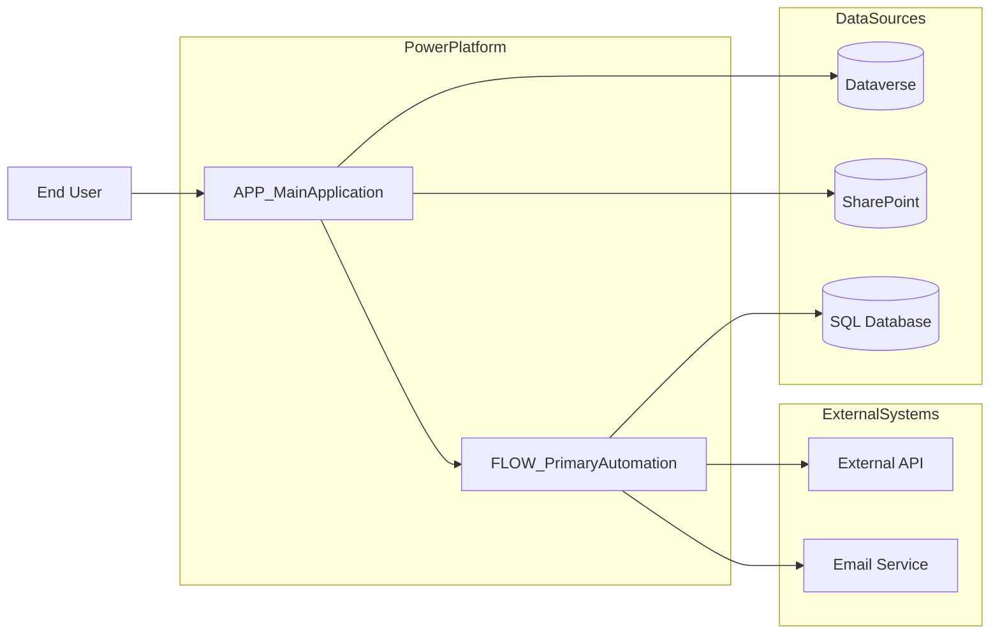
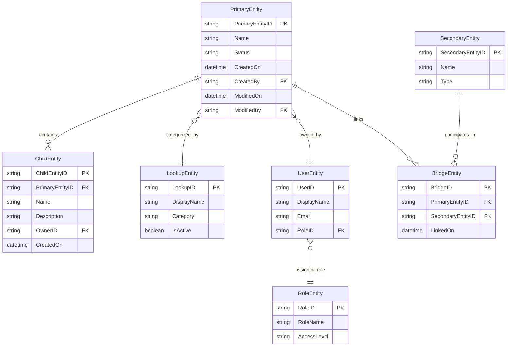
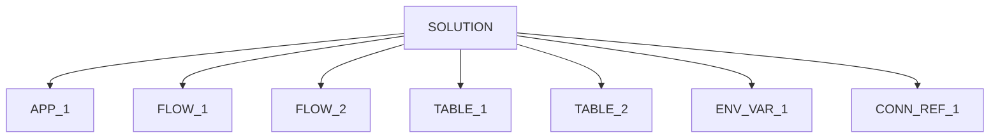
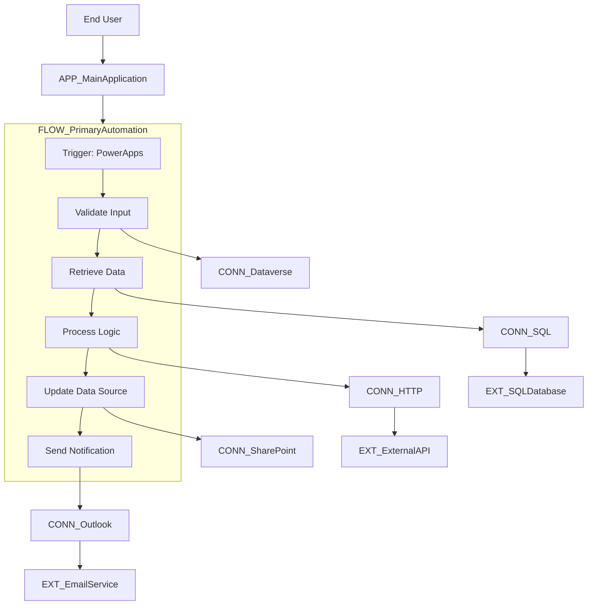

## Naming convention rules

|Component Type|Prefix|
|---|---|
|App|`APP_`|
|Flow|`FLOW_`|
|Table/List|`TABLE_`|
|Environment|`ENV_`|
|Role|`ROLE_`|
|Connector|`CONN_`|
|Variable|`ENVVAR_`|
|External System|`EXT_`|

## Architecture diagram format

## Data model format

## Solution Component Map

## Flow Execution + Connector Dependency Map

